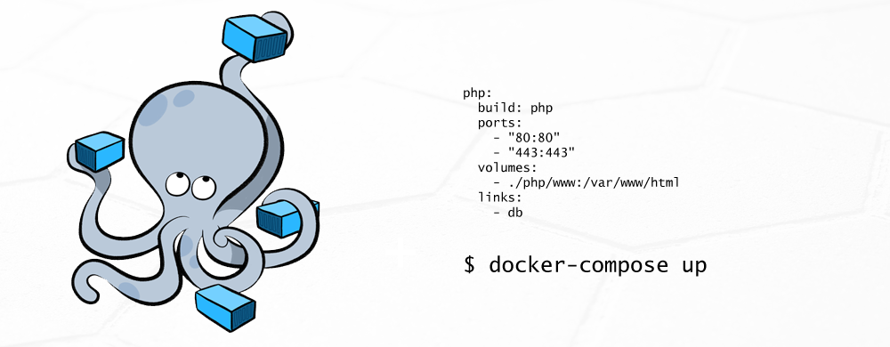

Bogdan Orzea

Anul II ID, 2016-2017

---

## Definiție

--

*Docker este o platformă cu scopul de a creea, de a publica și de a manageria containere cu aplicații virtuale, folosind la bază un sistem de operare comun și un ecosistem de unelte de control.* 

*Un container împacheteză o aplicație împreună cu toate librariile, configurațiile și dependințele ei.*

---

## Istoric

--

* Docker a apărut în 2013, promovat de compania Docker Inc.
* Open-source, codul fiind disponibil pe GitHub la https://github.com/docker
* Scris in limbajul GO
* Disponibile pe Windows 10, OS X, Linux, AWS sau Azure
* Cea mai recentă versiune este v17.06.0-ce

---

## Filozofia de funcționare

--

### Cum rulează un container?


--

### Ce conține un container?


--

### Workflow utilizare


---

## Produse Docker

--


--

### Docker Machine

* Soluție ce folosește VirtualBox
* Parte din Docker Toolbox
* Nu mai este soluția recomandată pentru desktop

--

### Docker Compose



--

### Docker Hub Registry (Docker Store)


--

### Kitematic


--

### Docker Swarm

* Soluție de management de cluster integrat cu Docker Engine
* Load balancing
* Securizat
* Multi-host networking
* Scalare

---

## Exemplu de folosire a unui container

--

### Creare container

* Având **Docker for Windows** instalat se navighează în folderul ce conține fișierul Docker
* Se deschide o fereastra CMD și se tastează:

```
docker build -f Dockerfile -t reveal.js-docker:latest .
```

--

### Conținut fișier Dockerfile

```
FROM node
RUN apt-get update && apt-get install -y git
RUN mkdir -p /revealjs
WORKDIR /revealjs

RUN git clone https://github.com/hakimel/reveal.js.git .
RUN npm install

ADD ./presentations /revealjs/presentations
ADD ./docker-entrypoint.sh /
RUN chmod u+x /docker-entrypoint.sh
ENTRYPOINT ["/docker-entrypoint.sh"]
```
--

### Rulare container

* Folosind o comandă CMD, se rulează containerul:

```
docker run -p 8000:8000 -p 35729:35729  reveal.js-docker
```

--
### Output container

```
PS C:\Users\ROBO\Desktop\reveal.js-docker> docker run -p 8000:8000 -p 35729:35729  reveal.js-docker
npm info it worked if it ends with ok
npm info using npm@5.0.3
npm info using node@v8.1.2
npm info lifecycle reveal.js@3.5.0~prestart: reveal.js@3.5.0
npm info lifecycle reveal.js@3.5.0~start: reveal.js@3.5.0

> reveal.js@3.5.0 start /revealjs
> grunt serve

Running "connect:server" (connect) task
Started connect web server on http://localhost:8000

Running "watch" task
Waiting...
```

--

### Alte comenzi utile

```
// se rulează o comandă pe container
docker exec -ti <ID> <COMANDA>
// sunt listate toate containerele ce rulează
docker container ps
// este oprit un container ce rulează
docker container stop <ID>
// sunt listate toate imaginile disponibile
docker images
// este downloadată o imagine din Docker Registry
docker pull <NUME>:<TAG>        
```
---

## Aplicabilitate containere

--

### Containere sunt folosite în

* Dezvoltare de aplicații
* Testare de aplicații <!-- .element: class="fragment" data-fragment-index="2" -->
* Instalare de aplicații <!-- .element: class="fragment" data-fragment-index="3" -->
* Deploy de servicii <!-- .element: class="fragment" data-fragment-index="4" -->

--

### Top imaginile de bază


--

### CI/CD


---

## Bibliografie

--

* https://docs.docker.com
* https://www.datadoghq.com/docker-adoption/
* https://github.com/danidemi/docker-reveal.js
* https://github.com/docker
* https://github.com/bogdanorzea/reveal.js-docker/tree/metode_dezvoltare_software

---


